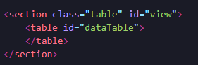
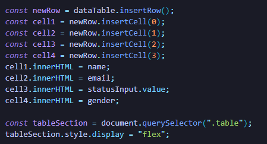
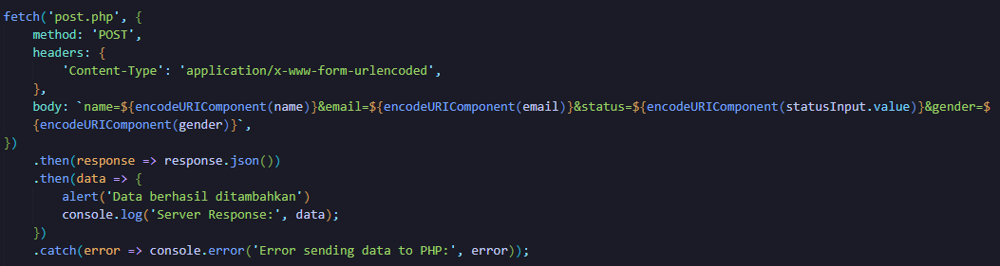
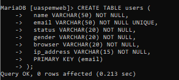
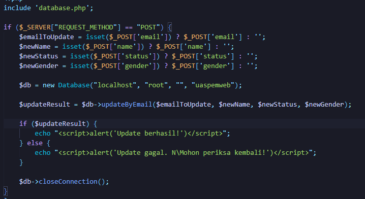
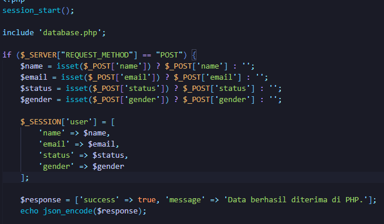

# Nama : Muhammad Widyantoro Wiryawan
# NIM : 121140183

# Bagian 1
1. Membuat form dengan 4 input  

2. Menampilkan table menggunakan tag table  
  
  

# Bagian 2
1. Transfer value yang diambil di Javascript ke PHP
  
2. Melakukan parsing
  
3. Menyimpan data ke database
  

# Bagian 3
1. Membuat tabel
  
2. Konfigurasi ke MYSQL PHP
  
3. Manipulasi data (Update)
  

# Bagian 4
1. Membuat Session
  
2. Pengelolaan Cookie
  

